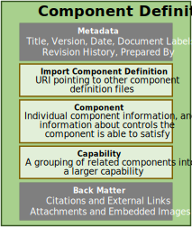

## Purpose

The OSCAL component definition model represents a description of the controls that are supported in a given implementation of a hardware, software, service, policy, process, or procedure. The component definition model is part of the OSCAL [implementation](../) layer.

The component definition model allows grouping related components into capabilities, and documenting how the combination of components in a capability together can satisfy specific controls that are not fully satisfied by a single component on its own.

These component definitions can be used by organizations implementing the thing defined by a given component to provide a significant amount of implementation details needed when documenting a system's control implementation in a system security plan.

## Concepts

Component definition model concepts are described in [concepts](../../concepts/#component-definition-model-concepts).

## Authors and Consumers

### Component Definition Authors

<table><tr><td style="background-color:#cccccc; border:none">
Product and Service Vendors, Capability Owners, Policy and Process Owners, Standards Bodies, Validation Bodies
</td></tr></table>

Component definitions are authored by vendors of products or services. The vendor can describe the product or service and align implementation settings with control baseline satisfaction.
Capability owners are similar to vendors, except they are typicall "in-house". An organization may establish a capability for use by many of the organization's systems and publish a component definition file about the capability.
Policy process owners can publish component definition files to document which controls are satisfied by the policy or process.
A standards body can publish a component definition file to indicate which controls are satisfied by the adoption of the standard.
Validation bodies, such as NIST Labs for FIPS 140-2 validaiton or Underwriters Laboratories for validation of electrical producs, can publish a component definition about the validation they performed on a product.

### Component Definition Consumers

<table><tr><td style="background-color:#cccccc; border:none">
System Owners and System Security Plan Authors
</td></tr></table>

As system owners identify components for use in their system, they consume component definition files by exporting the relevant content into their system security plan.

## Component Definition Organization

{}
{}
{}
&nbsp;

{}
{}
An OSCAL profile is organized as follows:
- **Metadata**: Metadata syntax is identical and required in all OSCAL models. It includes information such as the file's title, publication version, publication date, and OSCAL version. Metadata is also used to define roles, parties (people, teams and organizations), and locations.
- **Import**: Identifies a component definition from another resource, from which related information is referenced.
- **Component**: Provides informaiton about a defined component that can be part of an implemented system.
- **Capability**: Identifies a capability as a grouping of multiple components or capabiities. 
- **Back Matter**: Back matter syntax is identical in all OSCAL models. It is used for attachments, citations, and embedded content such as graphics. 
{}
{}

{}