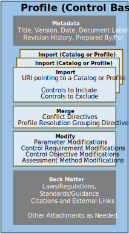

## Purpose

The OSCAL Profile model represents a baseline of selected controls from one or more control catalogs, which is referred to as a "[profile](/documentation/schema/profile-layer/#profile)" in OSCAL. The Profile model is the sole model in the OSCAL [Profile](../) layer.

## Concepts

Profile model concepts are described in [concepts](../../concepts/#profile-model-concepts).

## Authors and Consumers

### Profile Authors

<table><tr><td style="background-color:#cccccc; border:none">
Control Baseline Authors, Authorizing Officials, and System Owners 
</td></tr></table>

Profiles are authored by an organization that defines or governs control baselines, such as the High, Moderate, and Low baselines defined for NIST's Special Publication (SP) 800-53 controls.
Organizations may also author a profiles when they need to define or tailor a set of controls applicable to their organization. 
Finally, system owners or authorizing officials may author profiles to establish a baseline of tailored controls applicable to a specific system.

### Profile Consumers

<table><tr><td style="background-color:#cccccc; border:none">
System Security Plan Authors and Consumers, Auditors, Authorizing Officials and Component Definition Authors and Consumers
</td></tr></table>

Proifles are consumed by system owners and authorizing officials as the basis for the System Security Plan (SSP). 
An auditor uses a profile to assess a system in the context of its control baseline.
Component definition authors may use profiles to establish context for how a component could satisfy a control requirement.

## Profile Organization

{}
{}
{}
&nbsp;

{}
{}
An OSCAL catalog is organized as follows:
- **Metadata**: Metadata syntax is identical and required in all OSCAL models. It includes information such as the file's title, publication version, publicaiton date, and OSCAL version. Metadata is also used to define roles, parties (people, teams and organizations), and locations.
- **Import**: Identifies a catalog or other profile from which controls are to be imported. A control must be imported to be included in a baseline. All parameters and back-matter resources cited by an imported control are also imported.
- **Merge**: Provides directives as to how controls should be organized. It also provides directives for resolving conflicts where two or more variations of a control are imported as a result of multple import statements.
- **Modify**: Provides the ability to tailor imported controls, including their parameters, control requirement definitions, references, control objectives, and assessment actions. 
- **Back Matter**: Back matter syntax is identical in all OSCAL models. It is used for attachments, citations, and embeded content such as graphics. 
{}
{}

{}

## Content Examples

Multiple examples of baselines expressed using the OSCAL profile model can be found in the OSCAL GitHub repository in multiple formats:

| Source | Formats |
|:---|:---|
| NIST SP 800-53 rev 4 | \[[XML](https://github.com/usnistgov/OSCAL-content/blob/master/nist.gov/SP800-53/rev4/xml/)\] \[[JSON](https://github.com/usnistgov/OSCAL-content/blob/master/nist.gov/SP800-53/rev4/json/)\] \[[YAML](https://github.com/usnistgov/OSCAL-content/blob/master/nist.gov/SP800-53/rev4/yaml/)\]
| FedRAMP Baselines | \[[XML](https://github.com/gsa/fedramp-automation/blob/master/baselines/xml/)\] \[[JSON](https://github.com/gsa/fedramp-automation/blob/master/baselines/json/)\] \[[YAML](https://github.com/gsa/fedramp-automation/blob/master/baselines/yaml/)\]

You will also find the "resolved" version of each profile. These files end with the suffix `-resolved-profile_catalog` to indicate that the profile [resolution process](/documentation/processing/profile-resolution/) has been performed to generate a catalog containing only the selected and tailored controls defined by the profile.

The following OSCAL profile model examples are provided by the above.

### NIST SP 800-53 Revision 4 Baselines

The NIST HIGH, MODERATE and LOW baselines for the SP800-53 rev4 catalog are available [in the OSCAL content GitHub repository](https://github.com/usnistgov/oscal-content/tree/master/nist.gov/SP800-53/rev4):

* [HIGH](https://github.com/usnistgov/oscal-content/tree/master/nist.gov/SP800-53/rev4/xml/NIST_SP-800-53_rev4_HIGH-baseline_profile.xml)
* [MODERATE](https://github.com/usnistgov/oscal-content/tree/master/nist.gov/SP800-53/rev4/xml/NIST_SP-800-53_rev4_MODERATE-baseline_profile.xml)
* [LOW](https://github.com/usnistgov/oscal-content/tree/master/nist.gov/SP800-53/rev4/xml/NIST_SP-800-53_rev4_LOW-baseline_profile.xml)

There are also [JSON](https://github.com/usnistgov/oscal-content/tree/master/nist.gov/SP800-53/rev4/json) and [YAML](https://github.com/usnistgov/oscal-content/tree/master/nist.gov/SP800-53/rev4/yaml) versions of the NIST SP 800-53 rev4 profiles.

### FedRAMP Baselines

Also find examples representing the FedRAMP baselines (again for the HIGH, MODERATE and LOW impact levels) on [our web site](https://github.com/usnistgov/oscal-content/tree/master/fedramp.gov).

* [HIGH](https://github.com/usnistgov/oscal-content/tree/master/fedramp.gov/xml/FedRAMP_HIGH-baseline_profile.xml)
* [MODERATE](https://github.com/usnistgov/oscal-content/tree/master/fedramp.gov/xml/FedRAMP_MODERATE-baseline_profile.xml)
* [LOW](https://github.com/usnistgov/oscal-content/tree/master/fedramp.gov/xml/FedRAMP_LOW-baseline_profile.xml)

There are also [JSON](https://github.com/usnistgov/oscal-content/tree/master/fedramp.gov/json) and [YAML](https://github.com/usnistgov/oscal-content/tree/master/fedramp.gov/yaml) versions of the FedRAMP profiles.

